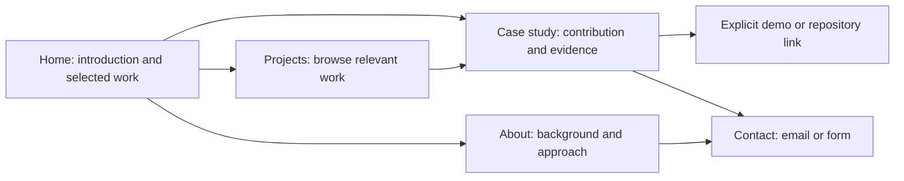

# Portfolio UI revamp: review and design proposal

- **Status:** Proposed design; implementation is a separate change.
- **Reviewed:** 2026-10-03.
- **Code baseline:** `aedd6bd` on `master`, the repository's default branch.
- **Live site:** [Luis Simosa's portfolio](https://luisportfolio-pied.vercel.app/).

## 1. Recommendation

Evolve the site into an editorial portfolio that puts the work first: a specific introduction, three substantial project previews, case studies with evidence, and a clear way to contact Luis. Keep the LS identity, restrained violet accent, bilingual routes, and light/dark themes. Replace the repeated floating panels, oversized social icons, and long technology lists with stronger typography, a consistent grid, and readable project stories.

The current site is understandable and its core pages load, but it presents an inventory of projects more effectively than it explains Luis's ability. The most valuable changes are better content hierarchy, credible project evidence, and reliable interactions. Visual polish should support those changes.

The repository has already received substantial modernization: Next.js 16, React 19, TypeScript, Tailwind 3, PostgreSQL, `next-intl`, an admin CMS, and integration tests. Build on these assets. A framework replacement, new CMS, or Tailwind migration is unnecessary for this proposal.

### Intended audience and outcomes

Assume the primary visitors are prospective employers, technical collaborators, and clients evaluating Luis as a software developer. The exact hiring/client emphasis can be refined before final copy is published.

Visitors should be able to:

1. Understand what Luis builds and for whom from the first screen.
2. Find relevant work and understand his contribution, decisions, and results.
3. Reach a working demo or repository through an accurately labeled link.
4. Contact him without encountering unclear controls or losing their message.
5. Complete these tasks on a phone, with a keyboard, and in either supported language.

## 2. Review method and evidence

The review combined source inspection with a read-only Chromium session against the public deployment. The production deployment's exact commit was not independently verified; the observed UI matches the reviewed components. Content is database managed and may change independently of code.

| Coverage | Observed result |
| --- | --- |
| Spanish home, about, projects, contact, and `/projects/ticker-scanner` at 390 × 844 | All returned HTTP 200. No horizontal document overflow on these routes. |
| English equivalents at 1440 × 1000 | All returned HTTP 200; no page-level JavaScript exceptions during the sampled sessions. |
| Spanish home at 1440 × 1000 | Desktop composition captured below. |
| About and projects at 320 and 768 px wide | No horizontal document overflow; this does not establish complete responsive coverage. |
| Mobile menu, zero-result filters, filter reload, theme toggle, locale switch, and logo navigation | Findings recorded in section 3. |
| Unknown project slug | HTTP 404 with the default English Next.js error page and no portfolio navigation. |

No contact messages were submitted, admin records changed, or production faults injected. Email delivery, authenticated admin usability, all external destinations, screen-reader operation, other browser engines, zoom, and reduced-motion behavior still require acceptance testing. No Lighthouse or field performance baseline was collected; performance numbers below are targets.

### Screenshot evidence

These are captures of the existing site, not proposed designs. Desktop capture: 1440 × 1000 viewport. Mobile captures: 390 × 844 viewport. Images include the full page.

| Screenshot | What to examine |
| --- | --- |
| [Desktop home](assets/ui-audit/home-desktop-light.png) | Similar visual weight for every panel; contact precedes work; small project images. |
| [Mobile home](assets/ui-audit/home-mobile-light.png) | Repeated labels, stacked social links, and a long project list. |
| [Mobile projects](assets/ui-audit/projects-mobile-light.png) | Twenty technology choices above six projects; duplicate technology spellings. |
| [Mobile about](assets/ui-audit/about-mobile-light.png) | Large repeated monogram and generic introduction dominate the page. |
| [Mobile contact, dark theme](assets/ui-audit/contact-mobile-dark.png) | Low-contrast navigation icons, placeholder-only fields, and bright input surfaces. |
| [Mobile project detail](assets/ui-audit/project-mobile-light.png) | Justified 24 px prose creates conspicuous gaps between words. |

### Strengths to preserve

- The site has a recognizable monogram, a simple route structure, and a restrained core palette.
- Six projects were available in both languages during the audit. There is already enough work to curate a useful landing page.
- The explicit language switch preserves a project slug and correctly refreshes the document language in the tested flow.
- Filters already use native buttons, fieldsets, and `aria-pressed`; the result count has a live announcement.
- The contact form already prevents repeat clicks while pending, resets only on success, and announces a returned result.
- Project content, translations, gallery captions, and ordering are editable in the existing CMS.
- Tests already cover routing, public/admin data, and contact persistence/email behavior. Extend these foundations during implementation.

## 3. Current UI findings

**P1:** Address before launching the redesign; affects comprehension, accessibility, or a main visitor task. **P2:** Follow once the core experience is sound. “Observed” means reproduced in the browser; “source” means confirmed in code without exercising the failure in production. Design judgments are recommendations, not measured conversion findings.

| ID / priority | Evidence and current behavior | Visitor impact and recommendation |
| --- | --- | --- |
| F01 / P1 | **Observed + design judgment:** Home starts with “Hi, my name is Luis” and a generic description, followed by a large contact panel. All six projects appear again on the home page. [Home](../src/app/%5Blocale%5D/page.tsx), [AboutSection](../src/components/AboutSection.tsx), [ProjectsSection](../src/components/ProjectsSection.tsx). | Luis's specialty and strongest work are hard to distinguish. Introduce a specific value statement and move three selected projects immediately after the hero. |
| F02 / P1 | **Observed + source:** Project cover and title links leave the site, while “Learn more” opens the case study. When no live URL exists, `mapProject` substitutes the repository URL; Ticker Scanner's “Visit page” and repository actions lead to the same repository. [ProjectCard](../src/components/ProjectCard.tsx), [ProjectDetail](../src/components/ProjectDetail.tsx), [data mapping](../src/lib/projectTypes.ts). | The apparent primary action has an unexpected destination. Make the title/preview open the case study and expose separate, explicit demo and source links only when applicable. |
| F03 / P1 | **Observed:** On `/en`, activating the logo navigates to `/` and shows Spanish content while `<html lang>` remains `en`. [NavLogo](../src/components/NavLogo.tsx) uses `next/link` with `/`, outside the locale-aware navigation helper. | A routine navigation action changes language and produces incorrect document semantics. Use the locale-aware home link and retain hard navigation for intentional locale changes until the layout's language handling is redesigned. |
| F04 / P1 | **Observed + source:** Menu/theme buttons have no accessible names. The menu lacks expanded/control attributes and remains open after Escape. Social links appear unnamed in the accessibility tree. [NavButton](../src/components/NavButton.tsx), [DarkModeToggle](../src/components/DarkModeToggle.tsx), [ContactLink](../src/components/ContactLink.tsx). | Controls are difficult to identify or operate without visual context. Add localized names, disclosure state, Escape dismissal, focus return, and visible social-link text. |
| F05 / P1 | **Observed + source:** Home, about, project index, and contact have no `h1`. Only home has a `main` landmark; project detail has an `h1` but no `main`. The shared shell has no skip link. [Locale layout](../src/app/%5Blocale%5D/layout.tsx) and route components. | Page structure is hard to navigate with assistive technology. Provide one main landmark, one descriptive page heading, sequential section headings, and a skip link. |
| F06 / P1 | **Observed + calculated:** Dark navigation uses violet `#6d28d9` on `#2e1065`, approximately **2.14:1** contrast. Small slate `#64748b` labels on that surface are approximately **3.20:1**. Light filter counts in `#94a3b8` on white are approximately **2.56:1**. | Important controls and secondary information are faint. Replace scattered color choices with tested semantic tokens in both themes. These ratios are computed from the current CSS colors, not a complete accessibility audit. |
| F07 / P1 | **Observed + source:** Contact inputs have placeholders but no persistent labels or required indicators. Server validation only checks nonempty trimmed strings, and all failures become one generic message. Returned status text has no dark foreground class. [ContactForm](../src/components/ContactForm.tsx), [contactSchema](../src/lib/contactSchema.ts), [handleForm](../src/app/contact/handleForm.ts). | Visitors receive insufficient help correcting a message; status text risks becoming unreadable in dark mode. Add labels, field errors, robust server validation, and complete themed states. |
| F08 / P1 | **Source; not exercised against production:** The service inserts a contact before sending email. Email failure leaves a saved record but returns failure to the visitor; a retry can create another record. The notification subject is “Test Email.” Existing [contact tests](../tests/contact.test.ts) explicitly cover that persistence behavior. | The interface's delivery claim and retry behavior need a defined contract. Establish durable acceptance, notification retry, and duplicate prevention before changing success copy; see section 6. |
| F09 / P1 | **Observed + source:** Twenty technology filters precede six projects. At 390 px width, the first card begins around **836 px** from the top. `mongoDB` and `mongodb` are separate choices. Choosing Backend + MUI produces zero cards with only a visually hidden count; reload resets selections. [ProjectFilters](../src/components/ProjectFilters.tsx), [ProjectList](../src/components/ProjectList.tsx). | Filtering hides the work and creates a blank-looking result. Simplify filters, normalize taxonomy, add visible counts/empty states, and preserve chosen filters in the URL. |
| F10 / P1 | **Observed + design judgment:** Project detail uses a single, justified 24 px paragraph. Ticker Scanner's subtitle says NestJS while its body says Next.js. The portfolio's own tags still say Next.js 14/MongoDB/Mongoose despite the current repository stack. Spanish NS-GM content includes an English description. | Layout and stale or inconsistent copy weaken credibility. Use readable case-study sections and review factual claims and translations before promotion. Confirm whether older stack labels describe a historical version and label that explicitly. |
| F11 / P2 | **Observed + source:** The 896 px body cap, repeated `rounded-3xl` surfaces/shadows, 96 px social tiles, uppercase pill CTAs, and duplicate section labels give unrelated content similar weight. Navigation has no current-page indication; desktop links sit in a `w-8` wrapper. [Root layout](../src/app/layout.tsx), [Navbar](../src/components/Navbar.tsx), [NavLinks](../src/components/NavLinks.tsx), [Button](../src/components/Button.tsx). | The presentation feels assembled component by component. Establish a deliberate page grid and hierarchy; remove the fragile nav width and distinguish active navigation. No desktop collision was reproduced in the sampled widths. |
| F12 / P2 | **Source:** Theme is applied in an effect after rendering and uses browser storage without error handling. Many interactions use `transition-all` and scale effects, with no shared reduced-motion treatment. [useDarkMode](../src/hooks/useDarkMode.ts), [global CSS](../src/app/globals.css). | There is a risk of a wrong-theme first paint and inconsistent motion. Resolve theme before first paint, tolerate storage failures, and provide restrained, explicit transitions. First-paint flashing was not measured. |
| F13 / P1 | **Observed + source:** Missing projects show the default English 404. There are no custom `loading.tsx`, `error.tsx`, or `not-found.tsx` files in the reviewed app. Data loaders can throw. | Failure recovery lacks context and a route back to work/contact. Design localized missing, loading, and unavailable states, with project failures isolated from the home introduction where practical. Production database failure was not simulated. |
| F14 / P2 | **Source:** Filled project images omit `sizes`; galleries declare square 850 × 850 dimensions and use captions as alt text without visible captions. Page metadata is limited and several routes inherit the Spanish root description. [ProjectCard](../src/components/ProjectCard.tsx), [ProjectDetail](../src/components/ProjectDetail.tsx), [root metadata](../src/app/layout.tsx). | Image delivery, reading context, and shared-link presentation need attention. Supply accurate image geometry and responsive sizes, visible captions, meaningful alt text, and localized page/share metadata. No transfer-size regression was measured. |

## 4. Proposed visual direction

### Editorial, practical, personal

Use a warm off-white canvas, dark ink typography, fine separators, and generous space around real project imagery. Keep the LS monogram as a small signature beside **Luis Simosa**. Use violet for the primary action, current navigation, and focus treatment. Dark mode should use neutral dark surfaces with a lighter violet accent, giving project media its own appropriate background.

The distinctive element is a sequence of numbered project stories with large previews and concise engineering summaries. A backend or CLI project can use a legible terminal capture or architecture diagram drawn from actual behavior. Avoid fabricating a dashboard or adding decorative code that implies features the project does not have.

Keep Inter, which is already loaded, and improve its hierarchy before adding font weight or new font families. A verified portrait can add personality on About; otherwise use a smaller monogram and prioritize the biography. Avoid another large logo as the main content.

### Initial design tokens

These are proposed starting values. Validate every actual foreground/background/state combination during implementation.

| Token / rule | Light | Dark |
| --- | --- | --- |
| Canvas | `#F7F7F2` | `#111318` |
| Surface | `#FFFFFF` | `#1B1E26` |
| Primary text | `#18181B` | `#F4F4F5` |
| Secondary text | `#52525B` | `#B4B4BE` |
| Accent / links | `#6D28D9` | `#C4B5FD` |
| Primary button | `#6D28D9` with white text | `#C4B5FD` with `#18181B` text |
| Decorative divider | `#D4D4D8` | `#3F3F46` |
| Input/control boundary | `#71717A` | `#8B8B98` |

- **Container:** 1120 px maximum for navigation and project layouts; 65 characters maximum for long prose. Move container constraints from `body` into public layout components so full-width backgrounds and the admin shell can evolve independently.
- **Grid:** 12 columns on wide screens; 24–32 px gaps. Two-column project previews from about 768 px when content fits; one column on narrow screens. Give the leading case study a full-width row.
- **Gutters:** 20 px on phones, 32 px on tablets, 48 px on wide screens; use 16 px where necessary at 320 px.
- **Type:** fluid 36–64 px `h1`, 28–40 px section titles, 22–28 px project titles, 16–18 px body with 1.55–1.7 line height, 14 px metadata. Left-align prose. Use sentence case for actions.
- **Spacing:** 4, 8, 12, 16, 24, 32, 48, 64, 96 px scale; approximately 48–64 px between mobile sections and 80–96 px on desktop.
- **Shape:** 12–16 px radius for previews/surfaces; 8–10 px for inputs/buttons; pills only for compact labels or filter selections. Prefer borders and spacing to repeated shadows.
- **Interaction:** approximately 150–200 ms color/opacity transitions; avoid moving the click target with scale effects. Respect reduced-motion settings and never require animation to reveal content.
- **Targets:** use at least 44 × 44 px hit areas for standalone controls as a project design standard. Maintain visible keyboard focus distinct from hover and active states.

## 5. Information architecture and page designs

Retain `/`, `/about`, `/projects`, `/projects/[slug]`, and `/contact`, plus their `/en` equivalents. Keep existing slugs and canonical/alternate URL behavior. The navigation order becomes **Work · About · Contact**, with language and theme controls grouped separately.



### Home

Lead with Luis's name and a clear role. Draft direction, subject to factual review: **“I build useful web applications and developer tools.”** Support it with one concrete sentence about the types of problems his selected work demonstrates. Do not invent availability, experience duration, clients, testimonials, or commercial outcomes.

The primary CTA is **View selected work**; the secondary is **Contact me**. Show three curated projects, then a compact background section and contact invitation. Keep GitHub and LinkedIn as labeled supporting links. The current homepage's exhaustive list belongs on Projects.

```text
Desktop
[LS Luis Simosa]          Work  About  Contact          ES/EN  Theme
------------------------------------------------------------------
Developer / short context
Specific value statement              One concrete supporting detail
[View selected work]  Contact me

Selected work                                      All projects ->
01  [large real project preview]      Title / problem / contribution
02  [preview and concise summary]     03  [preview and concise summary]

About / working approach             Contact invitation + email
------------------------------------------------------------------
Luis Simosa                          GitHub  LinkedIn  Copyright

Mobile
[LS Luis]                         Language  Theme  Menu
Specific value statement
Short introduction
[View selected work]  [Contact me]
Selected work
[preview]
01 / title / problem / contribution / View case study
[next project]
About summary -> Contact -> Footer
```

Keep the mobile hero compact enough that the first selected project preview begins within the initial 844 px viewport under normal text settings. Treat this as a layout check, not a reason to truncate translated text or constrain zoom.

### Projects

Start with an `h1`, a one-sentence introduction, and visible result count. With six projects, use a compact category control and put technology filtering behind **Filter by technology**, preferably a labeled native select initially. Preserve the existing category-and-technology intersection behavior. Search and pagination are unnecessary at the present scale.

Every preview should contain a substantial image, title, short problem statement, Luis's role or contribution where verified, and at most three representative technologies. Use category words a visitor understands, such as Web applications, APIs, and Developer tools; retain stable internal IDs and translate display labels.

Selecting a project title, preview, or “View case study” opens the internal detail route. Keep external links separate from the primary link, with clear labels and no nested interactive elements. If a destination opens another tab, indicate that behavior; it need not be the default.

### Case study

Use this repeatable structure:

1. Breadcrumb back to Projects, project title, concise outcome/problem statement, and optional status/year.
2. Large product screenshot, actual CLI example, or explanatory diagram.
3. Facts: role, collaborators, scope, time period, and stack, including only verified information.
4. **Problem and constraints:** who needed it and why it was difficult.
5. **My contribution and decisions:** concrete implementation choices and tradeoffs.
6. **Result and learning:** demonstrable behavior or measured results with context. When no usage metric exists, describe what the project achieved without inventing numbers.
7. Annotated screenshots with visible captions, followed by explicit demo/source actions.
8. Next project and a short contact invitation.

Use natural paragraph breaks and semantic headings. Remove justified prose and the current oversized body style. A coverage percentage can be technical evidence with a dated source, but should not substitute for explaining utility. For archived demos, show an honest status and retain the case study/source access.

### About

Explain Luis's current focus, background, and approach to building software in concise paragraphs. Connect a few capabilities to specific project evidence. Replace the exhaustive technology inventory with three or four meaningful groups and links to relevant work. Add location/time zone or a résumé link only when accurate and useful; avoid dead placeholder actions.

### Contact and footer

Present a short invitation, clickable email address, and a labeled form. Keep GitHub/LinkedIn as ordinary text links with small supporting icons. State a response expectation only if Luis can commit to it. The footer should provide identity, useful destinations, and the current year without another heavy floating card.

## 6. Behavior and state requirements

| Component / flow | Required behavior |
| --- | --- |
| Public shell | A named navigation landmark, skip link, one `main`, one `h1`, and `aria-current="page"` on the relevant nav link. On a case study, Work remains the active section. |
| Mobile navigation | A normal disclosure button with a localized name, `aria-expanded`, and `aria-controls`. Tab reaches the expanded links in order; Escape closes the disclosure and returns focus to its trigger. Close on route selection and when leaving the navigation. No focus trap is needed for this nonmodal design. |
| Theme | System preference on first visit; explicit selection persists across navigation/reload. Resolve the initial theme before paint with a strategy compatible with hydration. Handle unavailable storage; expose the control's action and current preference in its accessible name/state. |
| Language | Preserve the current route/slug and valid filter query parameters. An ordinary home or project link must stay in the active locale. Intentional switches update both text and `<html lang>`; test first-visit negotiation, stored preference, reload, and Back/Forward. |
| Filters | Reflect state in `?category=...&tech=...`; validate unknown values and support Back/Forward. Show the result count visibly and announce a concise update, rather than the entire results collection. Preserve zero-result combinations with an explanation and **Clear filters** action. Give counts a consistent documented meaning. |
| Project media | Reserve image space, fit screenshots without cropping essential controls, and provide a useful fallback when an image fails. Preserve the project title and link. Gallery captions should be visible; write alt text for the image's purpose. |
| Loading / errors | Stable preview placeholders for deferred content; localized project-list failure with Retry and a contact route. A missing slug has a localized 404 with Browse projects/Home links. Retain usable navigation and useful home content during a project-data outage. |
| Contact: editing | Persistent Name, Email, Message labels; `autocomplete` for name/email; required indicators and suitable length limits. Both server and browser validate; server returns field-specific errors. Connect hints/errors with `aria-describedby`, set `aria-invalid`, and move focus to an error summary or first invalid field. |
| Contact: pending | Keep entered text, disable duplicate submits, and announce progress. Do not replace the form with a spinner or rely on color alone. |
| Contact: success/failure | Reset only after acknowledged durable acceptance. Announce success with status semantics; preserve input on failure and provide retry plus email fallback. Give status/error text explicit colors in both themes. |

For the contact backend, define success as **one durably accepted inquiry**. Introduce a submission identifier and a durable notification job/outbox, or an equivalent retryable mechanism, so an email outage does not ask the visitor to reinsert an accepted inquiry. Return acceptance after the inquiry and notification job are saved; retry delivery separately. Do not claim this behavior until it exists. Until then, distinguish known persistence failure from notification failure and avoid automatic retries that create duplicate inquiries. Replace “Test Email” with a meaningful notification subject. Exercise this flow with a fake mail sender and an isolated test database.

Navigation should follow the WAI [disclosure navigation pattern](https://www.w3.org/WAI/ARIA/apg/patterns/disclosure/examples/disclosure-navigation/). Use native links/buttons and a list of destinations; ordinary site navigation does not require ARIA menu-widget semantics.

## 7. Content, data, and implementation boundaries

### Content preparation

Before finalizing the visual layout, choose three featured projects and prepare one complete case study in both languages. Selection should show relevant depth and different strengths; recency alone should not determine the order. NS-GM, a web application, and an API are possible candidates after verifying contribution and publishable evidence.

Review all six current projects for accurate names, URLs, stack, scope, screenshots, dates, claims, and Spanish/English equivalence. Normalize display names such as MongoDB, TypeScript, NestJS, and Next.js. Keep version information separate where it describes a historical implementation. Check external destinations and distinguish live, archived, and source-only projects. Explain unavailable demos instead of silently substituting another destination.

### Reuse the existing architecture

- Keep content and metadata rendering on the server; limit client state to navigation disclosure, theme, filters, and form feedback.
- Define semantic CSS variables for theme tokens and map them into the existing Tailwind 3 configuration. Add a small set of shared primitives: container, section heading, link/button variants, project preview, form field, and status message.
- Keep public layout sizing out of the root `body`; review admin layout for regressions when changing shared global styles.
- Preserve PostgreSQL translations and admin editing. Use the existing gallery/caption fields and ordering initially. A first pass can show the first three curated items in `display_order`; add explicit `featured` selection when independent ordering is needed.
- Structured case studies require a schema/API/admin change: add localized sections for problem, contribution/decisions, and result, with optional shared role/date/status metadata. Keep legacy `body` as a fallback during migration, then backfill content. Avoid hardcoding new case studies in components or rendering unsanitized database HTML.
- Expose nullable `liveUrl` and `repoUrl` separately to the public UI, preserving the existing database distinction. Remove the current semantic ambiguity of `url` falling back to a repository.
- Normalize technology IDs and display labels in a reviewed migration or content cleanup. Category/technology matching should use stable IDs across locales. Preserve existing slugs.
- Update the CMS only as needed to author the new fields and previews. Its full visual redesign can follow separately; maintain authentication, uploads, and revalidation.

### Image delivery and search presentation

Provide accurate `sizes` for responsive `next/image` usage and correct intrinsic dimensions or aspect ratios. Lazy-load lower-page media and only prioritize an actual above-the-fold image when measurement justifies it. Keep original assets legible and create appropriate thumbnail variants. These recommendations follow the [Next.js Image documentation](https://nextjs.org/docs/app/api-reference/components/image).

Add localized route descriptions, project share images, Open Graph/Twitter metadata, and descriptive titles. Preserve canonical/hreflang alternates, verify the production site URL, and add a sitemap/robots policy that includes public projects and excludes admin routes. Custom loading, error, and missing-page treatments should use the framework's route conventions; see [Next.js error boundaries](https://nextjs.org/docs/app/api-reference/file-conventions/error).

## 8. Delivery sequence

Each stage should be independently reviewable, with screenshots of both languages/themes where it changes UI. Scope estimates are relative, not calendar commitments.

| Stage | Scope and dependencies | Exit condition |
| --- | --- | --- |
| 1. Correct visitor-task defects (medium) | F02–F09 and F13: locale-safe logo, control semantics, landmarks, contrast, field feedback, clear external destinations, filter empty state, and recovery pages. Define the contact acceptance contract; isolate its persistence changes for focused review. | Keyboard, locale, error/retry, and contact acceptance checks pass; no success copy promises unimplemented delivery behavior. |
| 2. Establish content and visual foundation (medium) | Select work, fact-check bilingual copy, choose representative media, define tokens, build the shell and one project preview. Depends on real content to size the layout. | Review home and one complete case study at 390 and 1440 px, in both themes, including long Spanish text. |
| 3. Roll out page templates and authoring (large) | Implement home, project index/details, About, and Contact; add/backfill optional case-study fields and preserve old content fallback. | All six projects render; CMS edits remain usable; old URLs and localized content remain accessible. |
| 4. Verify and release (medium) | Image/metadata work, browser/accessibility checks, performance baseline, content/link review, and existing CI. | Acceptance matrix below passes on a preview deployment; record remaining limitations explicitly before rollout. |

Deploy in small changes so a visual regression can be reverted independently. Keep schema changes additive until old content has been migrated and verified. Preserve an accessible contact path throughout rollout.

## 9. Acceptance and measurement

### Design and functional checks

| Area | Release criterion |
| --- | --- |
| Comprehension | In a short review with 3–5 representative readers, most can describe Luis's focus and identify a relevant project after a brief home-page scan. Treat this as qualitative feedback, not statistical proof. |
| Responsive layout | Check 320, 390, 768, 1024, and 1440 px, portrait/landscape, long text, 200% text zoom, and reflow at 400% browser zoom. No clipped text, overlapping controls, or unintended horizontal page scroll. |
| Navigation and locale | Complete Home → Projects → case study → Contact by keyboard in both languages; logo preserves locale; explicit switching updates document language and retains route/filter state. Escape/focus behavior and current-section indication work. |
| Projects | Title/cover/CTA agree on case-study destination. Demo/source labels match their actual destinations. Filter counts, URL state, Back/Forward, clear action, and zero results behave consistently. |
| Contact | Test invalid/empty fields, valid acceptance, pending/double click, database failure, notification failure, and retries without duplicate inquiries. Preserve input on failure and show/announce the correct outcome in both themes/locales. Use isolated infrastructure and fake email delivery. |
| Resilience | Exercise missing project, empty collection, failed project fetch, failed image, unavailable browser storage, and slow responses. Navigation and recovery actions remain usable. |
| Content and CMS | Confirm translations, project claims, screenshots/captions, destinations, and optional-field fallbacks. Editing and reordering projects updates public pages in both locales. |
| Browser coverage | Chromium, Firefox, and WebKit plus a real iOS or Android touch pass. Add a screen-reader pass with NVDA or VoiceOver for navigation, forms, filters, and errors. |

Target **WCAG 2.2 AA**: normal text contrast at least 4.5:1, large text at least 3:1, applicable control/graphic contrast at least 3:1, visible unobscured focus, keyboard access, and correctly associated labels/status messages. Automated scanning supplements manual checks; a passing scan is not a conformance claim. The 44 px standalone target rule above is this design's stronger usability target; WCAG 2.2 AA's target-size criterion is 24 px with exceptions. See the [WCAG quick reference](https://www.w3.org/WAI/WCAG22/quickref/).

### Performance and verification

Capture a reproducible production-build baseline on Home, Projects, a media-rich detail page, and Contact, using the same device/network settings before and after implementation. Aim for good Core Web Vitals at the 75th percentile: **LCP ≤ 2.5 seconds, INP ≤ 200 ms, CLS ≤ 0.1**. These thresholds come from [Web Vitals guidance](https://web.dev/articles/vitals). Lab results guide development; do not present a single Lighthouse run as field INP or proof of these targets. If traffic is too low for field data, document that limitation and retain comparable lab measurements.

Run the existing integration tests against their dedicated test database, locale configuration/coverage checks, and production build as CI already requires. During implementation, add focused browser tests for the reproduced locale-logo defect, menu keyboard behavior, filter empty/URL state, and contact outcomes. Use targeted visual comparisons for the page templates; avoid snapshots of every incidental element.

For this documentation PR, validation consists of the source/browser review above, screenshot inspection, Markdown/link integrity checks, and the repository's normal PR checks. It does not claim that the proposed UI, accessibility, delivery, or performance targets have already been implemented.

### Decisions before implementation

The proposed defaults are sufficient to start design exploration: retain LS/violet/Inter, prioritize work, feature three projects, and use a neutral dark theme. Final content decisions still need Luis's input: the main audience, featured-project order, verified contributions/outcomes, a current biography, whether a portrait/résumé is available, and any response-time or availability statement. These decisions should refine the proposal without blocking the confirmed usability fixes.
